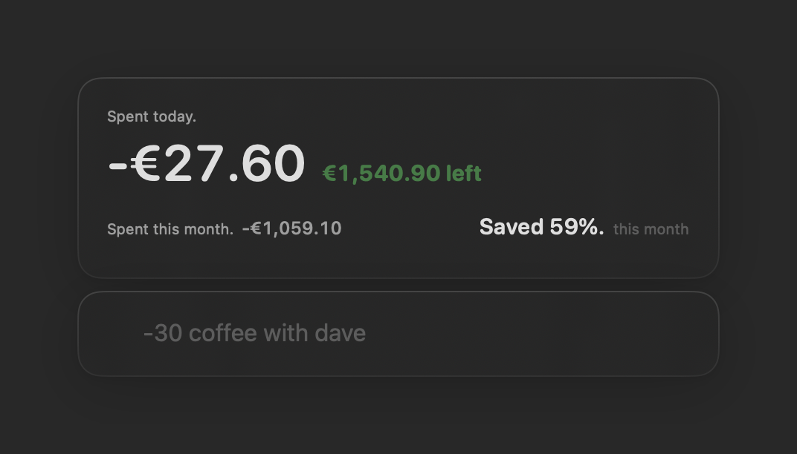
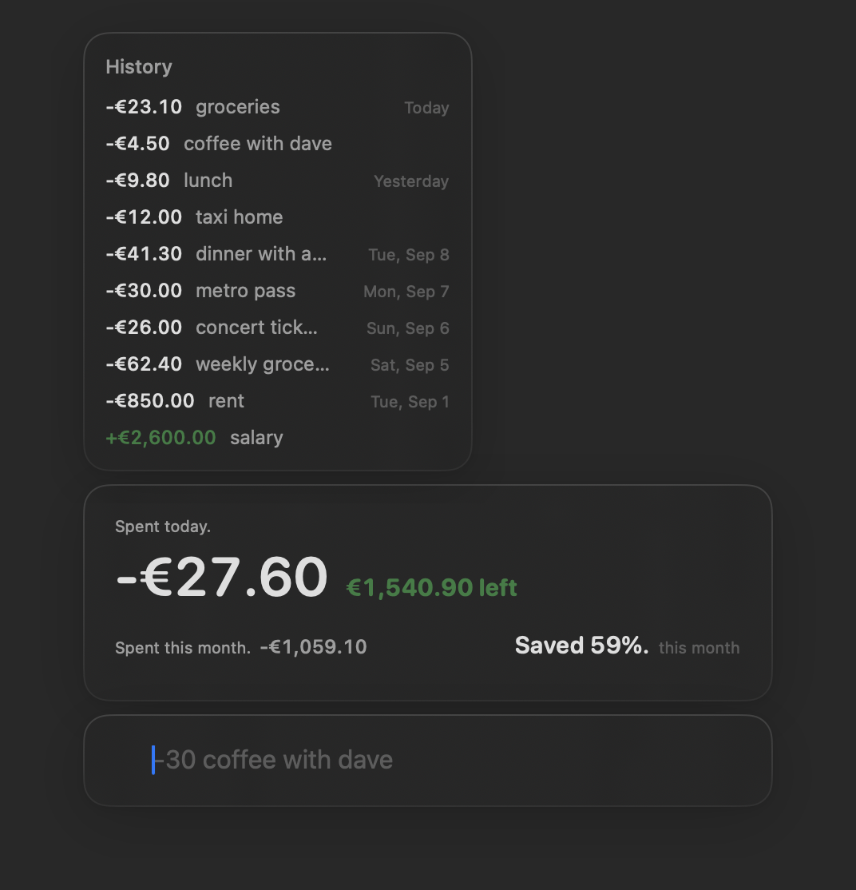
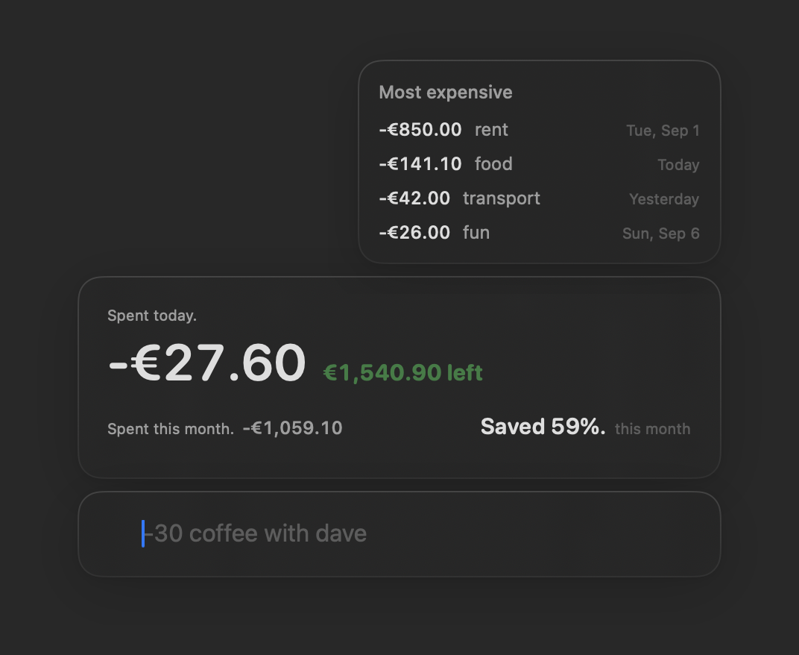

# mous

A tiny macOS popup for tracking your spending. Type one line, hit Return, done.


## What it is

mous is a small always-at-hand window with exactly one input field. You write
what happened, it does the math:

```
-4.50 coffee with dave      → spent €4.50
-23.10 groceries            → spent €23.10
+2600 salary                → got €2,600
-24uah taxi                 → spent 24 hryvnia (any currency you add)
```

The dashboard above the field always shows the numbers that matter: what you
spent today, what's left, what the month cost you, and how much of your income
you kept.



## Two peeks under the hood

Hold **⌘** and the popup shows its two shortcuts.

**⌘M — History.** The month's ledger, newest first, labeled by day:



**⌘X — Most expensive.** Where the money actually went, biggest first. If you
tag transactions with categories it ranks the categories; otherwise it ranks
the individual purchases:



## How it's put together

Two parts, both on your machine — nothing leaves your computer:

- **The popup** — a native Swift app (`macos/Mous`). Borderless, floats above
  everything, appears when you activate it and gets out of the way when you
  don't.
- **The API** — a small FastAPI + SQLite backend (`src/mous`) that stores
  accounts, transactions, currencies and categories. The app talks to it on
  `127.0.0.1:8000` and refuses to talk to anything else.

## Run it

Backend (Docker):

```sh
docker compose up -d
```

App (macOS 14+, Swift toolchain):

```sh
uv run mous dev     # builds and launches the popup
```

Or without Docker, run the API directly:

```sh
uv run mous serve
```

## Poking the API directly

Everything the app does goes through plain HTTP — so you can too. Interactive
docs live at `http://127.0.0.1:8000/docs` once the API is up.

```sh
# add a category and a tagged expense
curl -X POST 127.0.0.1:8000/categories -H 'Content-Type: application/json' \
     -d '{"name": "food"}'
curl -X POST 127.0.0.1:8000/transactions -H 'Content-Type: application/json' \
     -d '{"name": "groceries", "value": -23.10, "currency_id": 1, "category_id": 1}'
```

Values are signed: negative is an expense, positive is income, zero is not a
transaction.

## Development

```sh
uv sync                                                  # python deps
uv run mous serve                                        # API on :8000
swift run --package-path macos/Mous MousCoreCheck        # swift checks
swift build --package-path macos/Mous --product Mous     # build the app
```

Screenshots in this README are the real app driven by its demo hook:
`MOUS_DEMO_TYPE="-6.20 ramen with mia" ./Mous` types a line for real, and
`MOUS_DEMO_TIP=history|expensive ./Mous` opens a tip once loaded.
